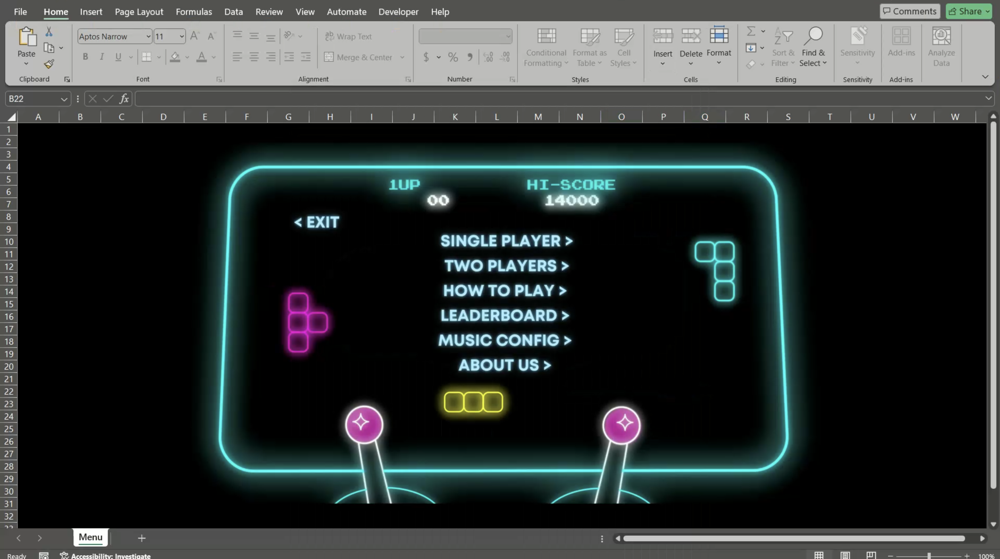
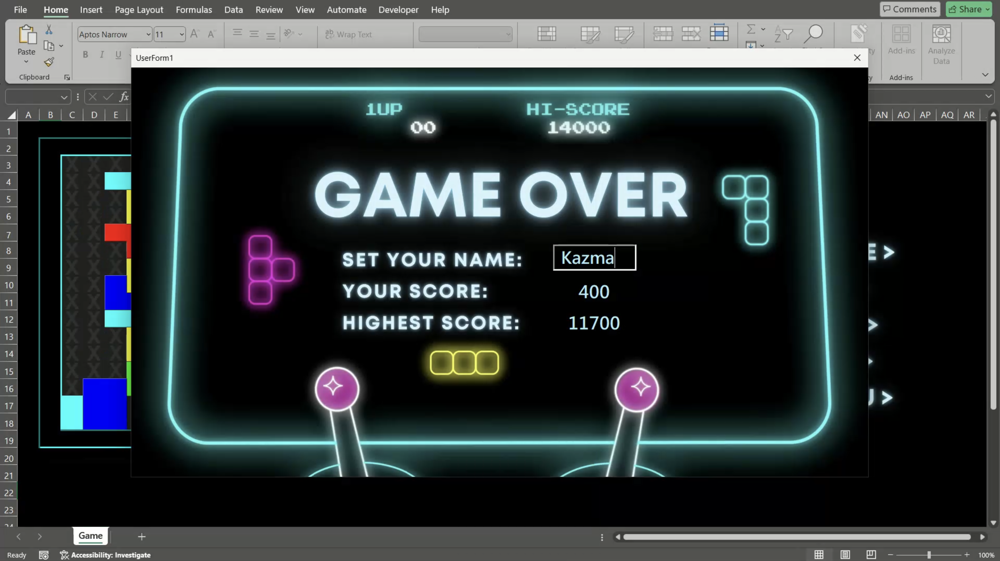

# Evil Rose 😈🌹

A classic Tetris game developed with Visual Basic for Applications (VBA).  
If you like it, please give us a star!⭐️

## Brief introduction

This project was initially developed with my classmate for a school course, but as we grew more enthusiastic about it, we decided to continue updating it.  
Its name "Evil Rose" was inspired by the Chinese homophones of "Tetris" XD

## Preview

Let's see what this game looks like:

- Cover
  
- Menu
  
- Rule
  
- Game
  
- Gameover
  
- Leaderboard
  
- Music
  

## Installation and Running

1. Run `git clone https://github.com/kazmatw/Evil-Rose.git`
2. Go into `Evil-Rose/` folder
3. Open `rose.xlsm`
4. Have fun!

It's just that EZ.😌

## Features

We know that Tetris is very popular nowadays, with many great websites and apps available. To introduce a new challenge, we've changed the number of columns to eight, which disrupts many common patterns. Additionally, we do not group the pieces into sets of seven, allowing the same piece the chance to appear consecutively. This tests the player's observation skills and strategic thinking. However, we do offer three opportunities to change the order of the pieces, so please seize the chance and have fun.  
Try to beat us, we've thrown down the gauntlet to you. 😼

## Controls

- Read the `How to play` game page. 📖

## Development

Writing a game in VBA might just be one of the most masochistic things to do in the world, especially when you're collaborating on an Excel file. However, we've employed Git to help manage our code. I've added a feature in ModExport that exports all the VBA code to .bas files. This way, everyone can clearly see what adjustments have been made. But if everyone is developing at the same time and there's an Excel conflict, well, we just have to resolve those conflicts manually—no other way around it ☹️

I primarily use Canva for the art design, and I've even started a 30-day trial for this, but I'm considering a long-term subscription moving forward. 🤔

Also, ensure IsDebugMode in ThisWorkbook is set to true before making any changes, as we restrict player interaction with Excel during gameplay to avoid crashes.

## Contributions

Feel free to send a PR if you want to update something~  
Just one thing to remember: make sure to run `ExportModules` under `ModExport` before you update. This way, we can clearly see what specific changes you've made.

## License and Permissions

This game is provided for free and can be freely used and distributed. However, please ensure compliance with applicable laws and regulations.
